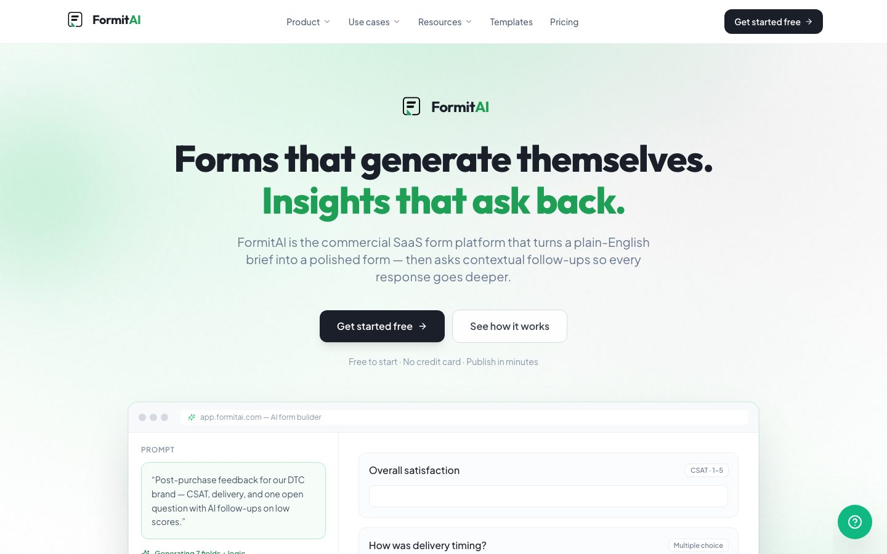
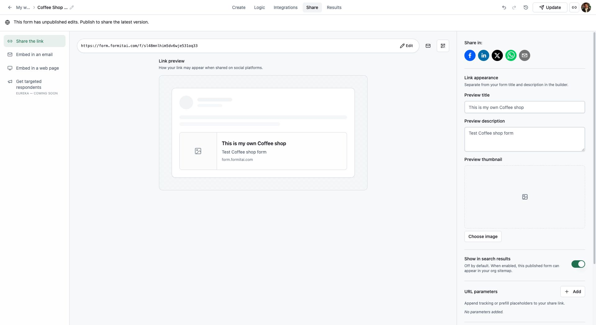
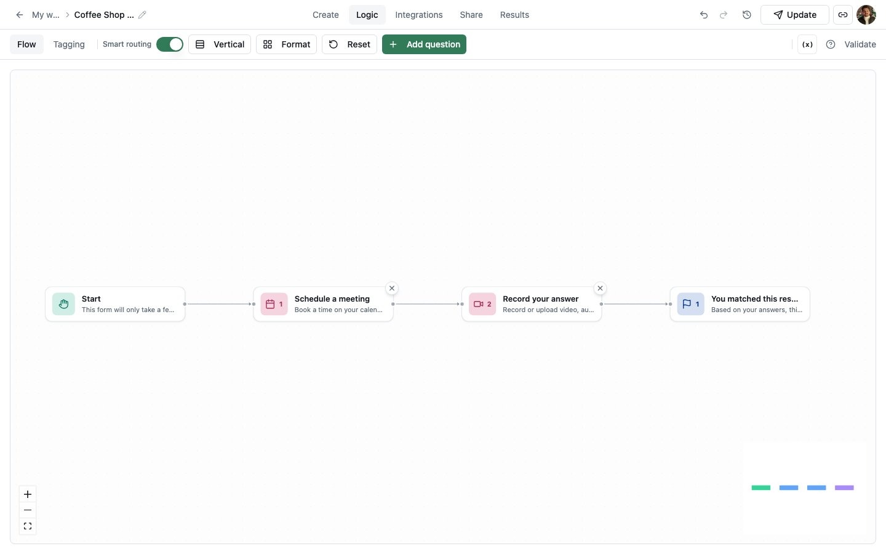
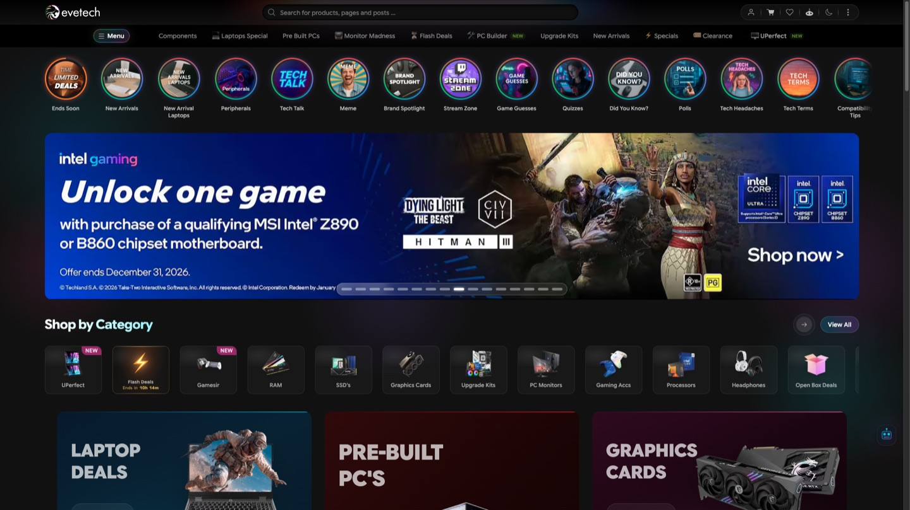
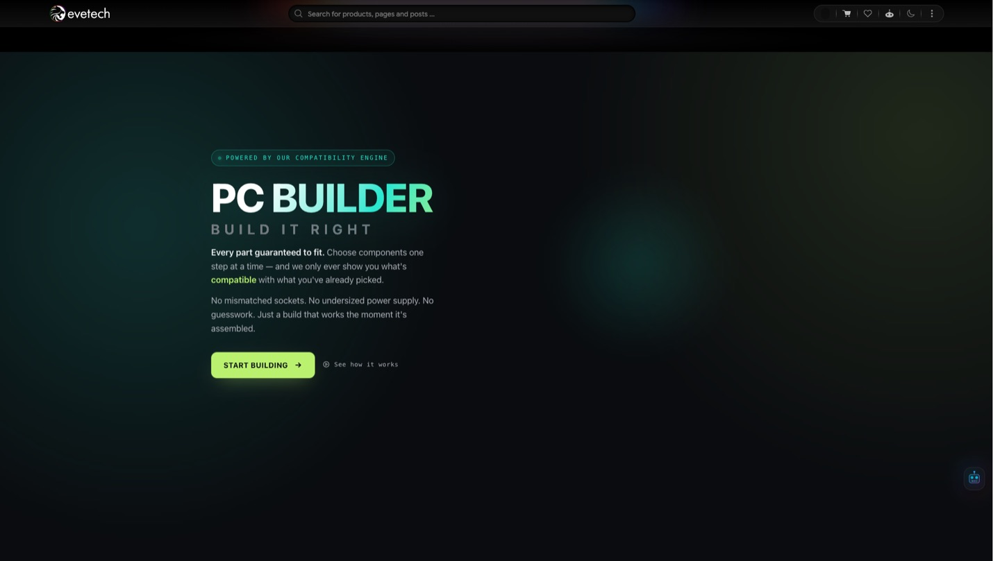
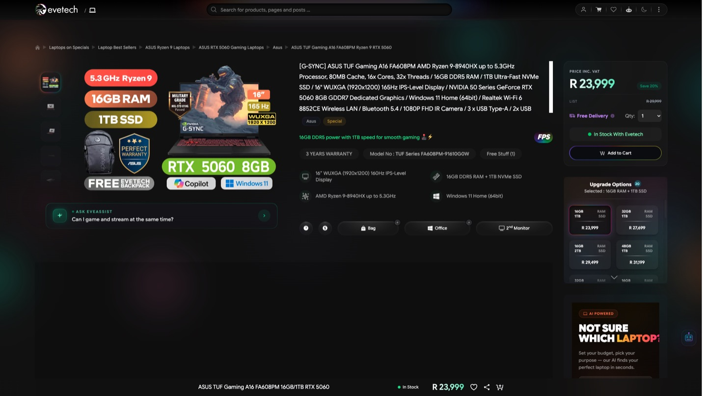
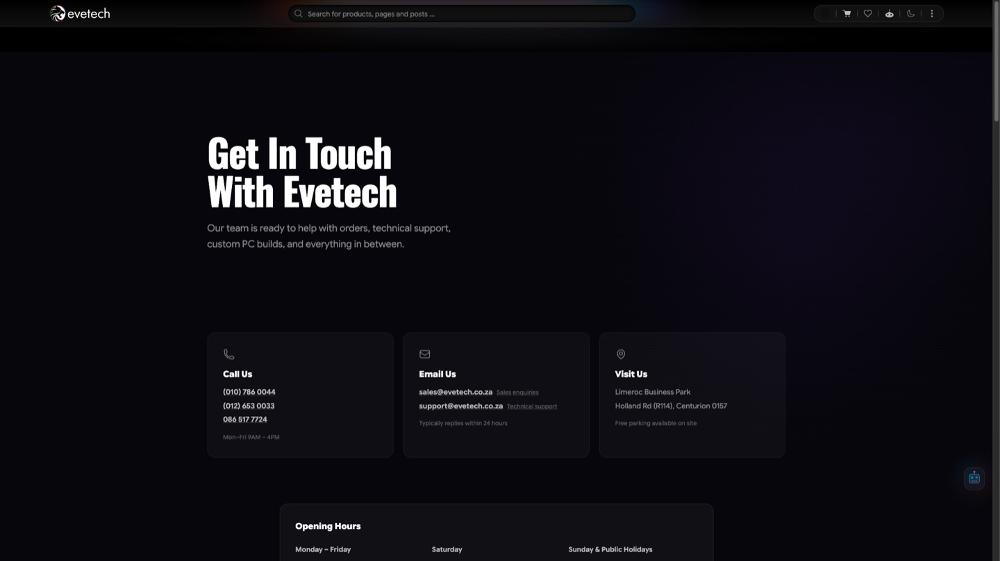
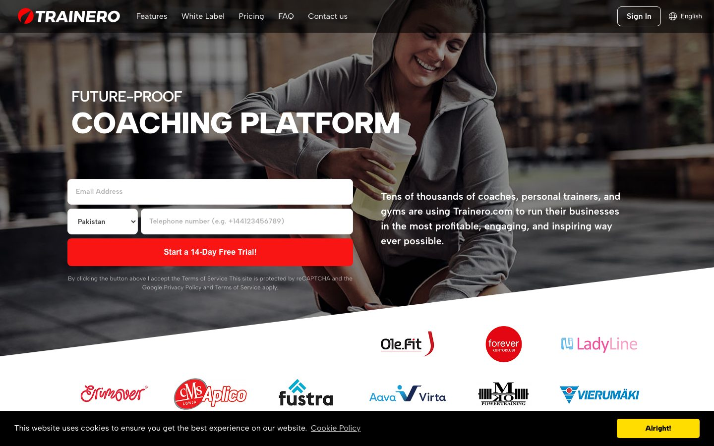
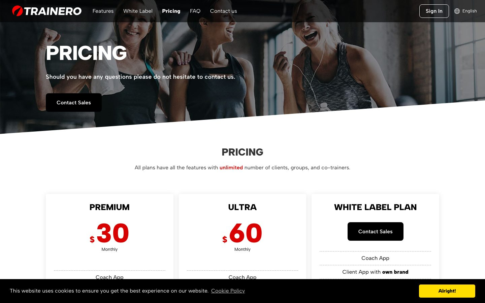
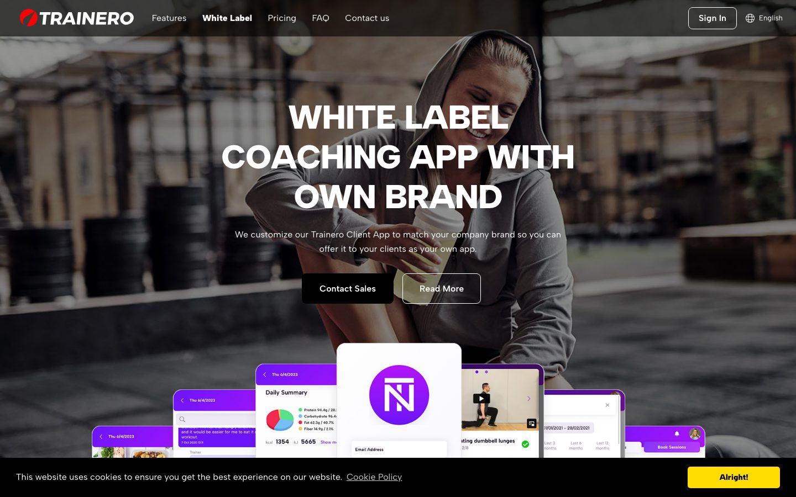

<h1 align="center">Tahir Amjad</h1>

  <strong>Full-Stack Developer · Next.js, React, SaaS &amp; AI</strong> 
  Founder of <a href="https://neurodek.com">Neurodek</a> · Top Rated Plus on Upwork

  
  
  
  

Most freelancers ship features. I ship products that stay online.

Eight years building SaaS, web apps, and AI tools for startups and long-term product teams. I founded [Neurodek](https://neurodek.com) so I can own the architecture, not just the ticket.

| **8 yrs** | **Top Rated Plus** | **100%** | **$100K+** | **40+ jobs** | **2 live SaaS** |
|:---------:|:------------------:|:--------:|:----------:|:------------:|:---------------:|
| shipping product | on Upwork | Job Success | earned | ~4,000 hours | shipped end to end |

  Also: App Store + Google Play apps · long-term EU coaching platform · multi-tenant APIs · React Native companions

---

## How I work

Scope, build, demo, iterate. Clear updates. No surprise scope.

I design the API and the tenancy, then wire the front end, so there is no handoff tax. If I'm not the right fit, I'll say so.

---

## Featured / Portfolio

Live portfolio. Click a preview to open the case in the [interactive portfolio](https://tahirkodx.github.io/tahirkodx/). Each card is title, hook, stack with icons, then the live link, then stills. Expand **Case study** for the short path from discussion to deploy, or read the full write-up in [`portfolio/`](portfolio/).

<table>
  <tr>
    <td colspan="2" valign="top">
      <h3><a href="https://formitai.com">FormitAI</a> · Featured</h3>
      
<strong>Describe the form. It builds itself, then asks the next question.</strong>

      
AI form builder SaaS. Prompt to fields to AI follow-ups on vague answers. Links, six embed modes, analytics, Slack / Sheets / Zapier. Shipped end to end: builder, runtime, API, tenancy, marketing, production.

      

        
        
        
        
        
        
        
        
      

      
<strong>Live:</strong> <a href="https://formitai.com">formitai.com</a> · <a href="https://app.formitai.com/dashboard">app.formitai.com/dashboard</a>

      

        
      

      

        
        
      

      

        
Case study

        
Four surfaces, one tenancy. Marketing, builder, public forms, and embed.js each got their own host. The Fastify API owns orgs, plans, and integrations that fan out after submit.

        
Shipped on Ubuntu, nginx, and PM2: formitai.com, app.formitai.com/dashboard, form.formitai.com, embed.formitai.com.

        

          <a href="portfolio/formitai.md">Case study page</a> ·
          <a href="https://formitai.com">Live product</a> ·
          <a href="https://tahirkodx.github.io/tahirkodx/#formitai">Open in portfolio</a>
        

      

    </td>
  </tr>
  <tr>
    <td colspan="2" valign="top">
      <h3><a href="https://www.evetech.co.za/">Evetech</a> · Featured</h3>
      
<strong>South Africa's gaming hardware store, redesigned on Next.js App Router.</strong>

      
eCommerce for gaming PCs, laptops, GPUs, and custom builds. I redesigned the storefront and migrated a live React catalog to Next.js App Router. Node and SQL Server stayed on the backend. Live at evetech.co.za, based in Centurion, Gauteng.

      

        
        
        
        
      

      
<strong>Live:</strong> <a href="https://www.evetech.co.za/">evetech.co.za</a> · <a href="https://www.evetech.co.za/pc-builder">PC Builder</a> · <a href="https://www.evetech.co.za/contact">Contact / Centurion</a>

      

        
      

      

        
        
        
      

      
Showroom: Limeroc Business Park, Holland Road (R114), Knoppieslaagte, Centurion, 0157, Gauteng, South Africa.

      

        
Case study

        
Keep Node and SQL Server. Rebuild the storefront. App Router for listings, product configs, and the PC builder. Design from scratch, shipped on the live catalog, store stayed up.

        

          <a href="portfolio/evetech.md">Case study page</a> ·
          <a href="https://www.evetech.co.za/">Live product</a> ·
          <a href="https://tahirkodx.github.io/tahirkodx/#evetech">Open in portfolio</a>
        

      

    </td>
  </tr>
  <tr>
    <td colspan="2" valign="top">
      <h3><a href="https://trainero.com">Trainero</a> · Featured</h3>
      
<strong>The coaching platform coaches actually live in.</strong>

      
Long-term product work on a European coaching business: trainer app, client app, workouts, chat, white-label. Vue / Quasar on the apps, AWS APIs behind them.

      

        
        
        
        
        
      

      
<strong>Live:</strong> <a href="https://trainero.com">trainero.com</a>

      

        
      

      

        
        
      

      

        
Case study

        
Long-term seat on a European coaching business. Work lives in the trainer and client apps: workouts, chat, white-label. Vue / Quasar on the clients, AWS APIs behind them.

        

          <a href="portfolio/trainero.md">Case study page</a> ·
          <a href="https://trainero.com">Live product</a> ·
          <a href="https://tahirkodx.github.io/tahirkodx/#trainero">Open in portfolio</a>
        

      

    </td>
  </tr>
  <tr>
    <td width="50%" valign="top">
      <h3><a href="https://flapjack.co">Flapjack</a></h3>
      
<strong>Design the menu like a canvas. Publish it like a site.</strong>

      
Restaurant menu builder. Next.js editor with Konva for layout. Restaurants get a visual builder instead of a Word doc and a hope. Live at flapjack.co.

      

        
        
        
        
      

      
<strong>Live:</strong> <a href="https://flapjack.co">flapjack.co</a>

      

        
      

      

        
Case study

        
A restaurant menu is a canvas, not a spreadsheet. Next.js hosts the editor. Konva owns layout. Zustand keeps canvas state off the page tree. Live at flapjack.co.

        

          <a href="portfolio/flapjack.md">Case study page</a> ·
          <a href="https://flapjack.co">Live product</a> ·
          <a href="https://tahirkodx.github.io/tahirkodx/#flapjack">Open in portfolio</a>
        

      

    </td>
    <td width="50%" valign="top">
      <h3><a href="https://www.morphood.com">Morphood</a></h3>
      
<strong>Any recipe. Morphood makes it fit the diet in the room.</strong>

      
AI recipe product: transform a dish for allergy, diet, or preference, then cook from it. Nutrition breakdown, cook-mode, live homepage. Also on the App Store.

      

        
        
        
      

      
<strong>Live:</strong> <a href="https://www.morphood.com">morphood.com</a> · <a href="https://apps.apple.com/app/morphood-personalize-recipes/id1616706707">App Store</a>

      

        
      

      

        
Case study

        
Take a recipe, adapt it for the diet in the room, then cook from it. Nutrition and cook-mode sit next to the rewrite. Web at morphood.com, iOS on the App Store.

        

          <a href="portfolio/morphood.md">Case study page</a> ·
          <a href="https://www.morphood.com">Live product</a> ·
          <a href="https://tahirkodx.github.io/tahirkodx/#morphood">Open in portfolio</a>
        

      

    </td>
  </tr>
  <tr>
    <td width="50%" valign="top">
      <h3><a href="https://clicksfence.com">ClicksFence</a></h3>
      
<strong>Stop paying Google for bot clicks.</strong>

      
Click-fraud SaaS for advertisers. One script, real-time blocking, session replay, then optional IP sync into Google Ads. I built the tracker, workers, replay, billing, and multi-tenant dashboard.

      

        
        
        
        
        
        
        
      

      
<strong>Live:</strong> <a href="https://clicksfence.com">clicksfence.com</a>

      

        
      

      

        
Case study

        
One script on the advertiser's site. Workers score the click. rrweb replay lets a human confirm a block. Optional IP lists sync into Google Ads. I built the tracker, workers, replay, billing, and multi-tenant dashboard.

        

          <a href="portfolio/clicksfence.md">Case study page</a> ·
          <a href="https://clicksfence.com">Live product</a> ·
          <a href="https://tahirkodx.github.io/tahirkodx/#clicksfence">Open in portfolio</a>
        

      

    </td>
    <td width="50%" valign="top">
      <h3><a href="https://snap2list.com">Snap2List</a></h3>
      
<strong>Photo in. eBay listing out. Inventory stays in sync.</strong>

      
eBay listing + inventory dashboard. Scan a barcode, generate the listing, bulk-revise prices, print SKU labels, sync from a React Native warehouse app. Live at snap2list.com.

      

        
        
        
        
        
        
      

      
<strong>Live:</strong> <a href="https://snap2list.com">snap2list.com</a>

      

        
      

      

        
Case study

        
Warehouse capture on React Native. Dashboard turns a scan into an eBay listing, revises prices in bulk, and prints SKU labels. Supabase is the shared store. Live at snap2list.com.

        

          <a href="portfolio/snap2list.md">Case study page</a> ·
          <a href="https://snap2list.com">Live product</a> ·
          <a href="https://tahirkodx.github.io/tahirkodx/#snap2list">Open in portfolio</a>
        

      

    </td>
  </tr>
  <tr>
    <td width="50%" valign="top">
      <h3><a href="https://tahiramjad.com">Neurodek Voice Agent</a></h3>
      
<strong>Drop an AI agent on any website. Chat, voice, or both.</strong>

      
Embeddable widget: visitors type, talk, or switch mid-conversation. Control plane for assistants, knowledge bases, and call analytics. LiveKit pipeline under the hood. Hosted at tahiramjad.com.

      

        
        
        
        
        
        
        
      

      
<strong>Live:</strong> <a href="https://tahiramjad.com">tahiramjad.com</a>

      

        
      

      

        
Case study

        
Dashboard, control plane, and a LiveKit worker. Visitors chat, talk, or switch mid-conversation. PersonaPlex is the custom-voice path: upload reference audio, train, ship it on the widget.

        

          <a href="portfolio/voice-agent.md">Case study page</a> ·
          <a href="https://tahiramjad.com">Live product</a> ·
          <a href="https://tahirkodx.github.io/tahirkodx/#voice-agent">Open in portfolio</a>
        

      

    </td>
    <td width="50%" valign="top">
      <h3><a href="https://apps.apple.com/us/app/kuntokompassi-online/id6689495083">Kuntokompassi Online</a></h3>
      
<strong>A Finnish studio's coaching app. Live on the stores.</strong>

      
Plans, progress, coach chat. Quasar / Vue client, Capacitor wrap, shipped to App Store and Google Play for SHW Training Oy.

      

        
        
        
      

      
<strong>Live:</strong> <a href="https://apps.apple.com/us/app/kuntokompassi-online/id6689495083">App Store</a> · <a href="https://play.google.com/store/apps/details?id=fi.kuntokompassi.online.app">Play</a>

      

        
      

      

        
Case study

        
Plans, progress, coach chat for a Finnish studio. Quasar / Vue client, Capacitor wrap, shipped to App Store and Google Play for SHW Training Oy.

        

          <a href="portfolio/kuntokompassi.md">Case study page</a> ·
          <a href="https://apps.apple.com/us/app/kuntokompassi-online/id6689495083">Live product</a> ·
          <a href="https://tahirkodx.github.io/tahirkodx/#kuntokompassi">Open in portfolio</a>
        

      

    </td>
  </tr>
  <tr>
    <td width="50%" valign="top">
      <h3><a href="https://velmoreexecutive.com">Velmore Executive</a></h3>
      
<strong>Dispatch, drivers, and bookings in one ops system.</strong>

      
UK chauffeur SaaS. Calendar, maps, live job state, Stripe. Public booking site plus admin. React Native driver app sits next to it.

      

        
        
        
        
        
      

      
<strong>Live:</strong> <a href="https://velmoreexecutive.com">velmoreexecutive.com</a>

      

        
      

      

        
Case study

        
Public booking, admin ops, and a driver app. Calendar, maps, live job state, Stripe. Fastify API with Prisma on PostgreSQL. Live at velmoreexecutive.com.

        

          <a href="portfolio/velmore.md">Case study page</a> ·
          <a href="https://velmoreexecutive.com">Live product</a> ·
          <a href="https://tahirkodx.github.io/tahirkodx/#velmore">Open in portfolio</a>
        

      

    </td>
    <td width="50%" valign="top">
      <h3><a href="https://www.thesippass.com">SIP Pass</a></h3>
      
<strong>Tickets that scan at the door. Checkout on the web.</strong>

      
Event / pass platform: Next.js public sites, Fastify API, React Native scan app, QR issuance, Paystack. Built for a crowd, not a demo tap.

      

        
        
        
        
        
      

      
<strong>Live:</strong> <a href="https://www.thesippass.com">thesippass.com</a>

      

        
      

      

        
Case study

        
Next.js public sites, Fastify API, React Native scan app. QR at the door, Paystack on the web. Built for a crowd, not a demo tap.

        

          <a href="portfolio/sip-pass.md">Case study page</a> ·
          <a href="https://www.thesippass.com">Live product</a> ·
          <a href="https://tahirkodx.github.io/tahirkodx/#sip-pass">Open in portfolio</a>
        

      

    </td>
  </tr>
</table>

---

## Also shipped

Same bar. Shorter cards. Some sit behind logins, so no live preview.

<table>
  <tr>
    <td width="50%" valign="top">
      <h3>WhatsApp SaaS gateway</h3>
      
<strong>Your own WhatsApp API. Multi-session. Self-hosted.</strong>

      
NestJS gateway, React ops dashboard, webhooks, API keys, Docker. For teams that need messaging infrastructure they control, without Cloud API lock-in.

      

        
        
        
        
        
        
      

    </td>
    <td width="50%" valign="top">
      <h3>AssetBridge</h3>
      
<strong>A property portfolio that doesn't look like a spreadsheet.</strong>

      
UK property-investment web app. Holdings, pulse, fintech-style dashboard. React, Three.js, GSAP, Recharts.

      

        
        
        
        
      

    </td>
  </tr>
  <tr>
    <td width="50%" valign="top">
      <h3>Kyrio POS</h3>
      
<strong>POS that still works when the shop is slammed.</strong>

      
Backoffice + kiosk stack. Catalog, staff, orders, reporting. React front, Express / Mongo API, S3 for media.

      

        
        
        
        
      

    </td>
    <td width="50%" valign="top">
      <h3>Open SEO</h3>
      
<strong>SEO research as a product, not a PDF export.</strong>

      
Rank tracking, keyword research, DataForSEO, Cloudflare Workers, AI agents. Built for people who live in the data every week.

      

        
        
        
        
        
      

    </td>
  </tr>
</table>

Nonprofit / foundation work (Websquare, NZF, Olive Grove) and PHP product oversight when the brief matches. If it isn't shipped, it isn't here.

---

## Quote

Famous lines from the web. The card and the line both rotate. GitHub Actions rewrites this block every few hours, and the card URL is cache-busted so GitHub fetches a new one.

<!--FEED:QUOTE:START-->

  

> All our knowledge has its origins in our perceptions.
>
> Leonardo da Vinci

Card via github-readme-quotes. Line via ZenQuotes. Both refresh on a schedule.
<!--FEED:QUOTE:END-->

---

## Latest from the web

Hacker News and BBC Technology. Headline, title, and a short dek. Rewritten automatically so it does not go stale.

<!--FEED:NEWS:START-->
<table>
  <tr>
    <td width="50%" valign="top">
      
<strong>Hacker News</strong>

      <h3><a href="https://kagi.com/changelog#11296">Kagi added a setting for removing paywalled links from search results</a></h3>
      
From kagi.com. 1191 points on Hacker News, 374 comments. Posted by speckx.

    </td>
    <td width="50%" valign="top">
      
<strong>BBC Technology</strong>

      <h3><a href="https://www.bbc.co.uk/news/videos/cy4k4d3lj21o">Robot horse and rider steal the spotlight at Chinese conference</a></h3>
      
More than 300 companies are showcasing the latest advances in robotics at the five-day event in Beijing, China, organisers say.

    </td>
  </tr>
  <tr>
    <td width="50%" valign="top">
      
<strong>Hacker News</strong>

      <h3><a href="https://www.nytimes.com/2026/08/21/us/politics/samuel-tunick-deleted-phone-felony.html">Felony charges for citizen deleting phone data at US Border</a></h3>
      
https://archive.ph/SflVC https://www.youtube.com/watch?v=_2rokxux5cU

    </td>
    <td width="50%" valign="top">
      
<strong>BBC Technology</strong>

      <h3><a href="https://www.bbc.co.uk/news/articles/cwyr0l45xjro">TikTok to pay $400m to US in one of largest child privacy settlements</a></h3>
      
The deal stems from a 2024 lawsuit alleging TikTok and its parent company ByteDance collected "vast amounts of data" on millions of users under the.

    </td>
  </tr>
  <tr>
    <td width="50%" valign="top">
      
<strong>Hacker News</strong>

      <h3><a href="https://www.felonybench.com/">Felony Bench</a></h3>
      
From felonybench.com. 785 points on Hacker News, 307 comments. Posted by colinprince.

    </td>
    <td width="50%" valign="top">
      
<strong>BBC Technology</strong>

      <h3><a href="https://www.bbc.co.uk/news/articles/cpq3w3v19veo">How landscape gardening is being electrified</a></h3>
      
The switch to quieter electric equipment is not going as fast as some would like.

    </td>
  </tr>
</table>

Updated 22 Aug 2026, 15:40 UTC. Hacker News front page + BBC Technology RSS.
<!--FEED:NEWS:END-->

---

## Stack

What I actually ship with. Grouped the way a product is built.

### Frontend

  
  
  
  
  
  
  
  

  
  
  
  

### Backend

  
  
  
  
  
  

  
  
  
  
  
  
  

### Third-party libraries

  
  
  
  
  
  
  

  
  
  
  

### Payment gateways

  
  

### API integration platforms

Slack, Sheets, Zapier on FormitAI. Google Ads IP sync on ClicksFence. eBay on Snap2List. Email via Resend.

  
  
  
  
  
  
  

### AI

  
  

### Voice pipeline

Browser WebRTC calls. STT → LLM → TTS, or speech-to-speech. Chat, voice, or both on the same widget.

  
  
  
  
  

### PersonaPlex voice agent

NVIDIA PersonaPlex speech-to-speech on the Neurodek widget. Moshi server, LiveKit plugin, GPU workers. Visitors talk. The agent talks back. No stock TTS round-trip.

  
  
  
  
  

### Custom voice modeling

Upload reference audio. Train a PersonaPlex voice. Test it in super-admin. Ship it on a widget. Not a vendor dropdown.

  
  
  

### Cloud and infra

  
  
  
  

---

## GitHub

Public repos are a slice. The products above are the catalog.

Stats and languages still come from a stats API. The contribution calendar is a live activity graph (GitHub's own contribution data), not a hosted streak card. Streak hosts often fail with "Failed to retrieve contributions" when GitHub's API rate-limits them.

<table width="100%">
  <tr>
    <td width="50%" align="center">
      
    </td>
    <td width="50%" align="center">
      
    </td>
  </tr>
</table>

  

---

## Contact

SaaS build, Next.js / React app, production AI feature, or a long-term product seat:

- **Upwork:** [upwork.com/freelancers/tahiramjad](https://www.upwork.com/freelancers/tahiramjad)
- **Site:** [tahiramjad.com](https://tahiramjad.com)
- **Studio:** [neurodek.com](https://neurodek.com)
- **LinkedIn:** [tahir-amjad](https://linkedin.com/in/tahir-amjad-8b6750162)

Send what you're building. I'll tell you straight if I'm the right fit.
