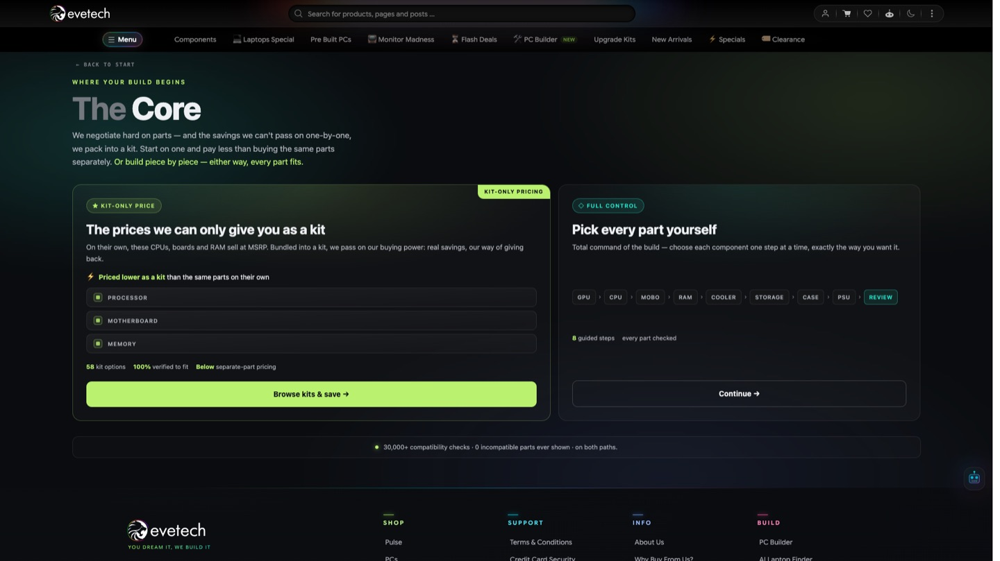

# Evetech

**South Africa's gaming hardware store, redesigned on Next.js App Router.**

Live: [evetech.co.za](https://www.evetech.co.za/) · [Open in portfolio](https://tahirkodx.github.io/tahirkodx/#evetech)

Gaming PCs, laptops, GPUs, custom builds. A real catalog with a showroom behind it, not a demo store.

## Problem

The old frontend was a React SPA. Fine for a small catalog. Painful for a South African gaming store with this much SKU density.

Search paid for client render. First load paid for it. Product pages with RAM and SSD upgrade configs paid for it. The design had also aged past what the brand sells now.

## What we discussed

Keep the backend. Node APIs and SQL Server already owned checkout, stock, and orders. Replacing that would have been a second project.

Rebuild the storefront. Next.js App Router, latest, for listings, product pages, PC builder, and content. Design from scratch. Not a theme on the old React tree.

Ship it on the live catalog. The store stays up.

## What shipped

- Full visual redesign of the storefront
- Migration from a React SPA to Next.js App Router
- Homepage with flash deals, category rails, and campaign banners
- PC builder with a compatibility engine, kit path and full-control path
- Product pages with live price, stock, and RAM / SSD upgrade configs
- Contact, hours, and the Centurion showroom
- Dark gaming UI that holds real SKUs, not lorem cards

## How it was built

Next.js App Router on the frontend. React for the interactive surfaces, PC builder steps, upgrade grids, search. Node on the API side. SQL Server for catalog, stock, and orders.

The App Router cutover is the SEO and first-load half. The redesign is the half customers actually see. Both had to land on the same production catalog.

## How it was deployed

Live at [evetech.co.za](https://www.evetech.co.za/). Production migration, not a greenfield rewrite sitting on a staging domain.

## Location

Evetech is based in Centurion, Gauteng, South Africa.

Limeroc Business Park  
Limeroc Business Park, Holland Road (R114), Knoppieslaagte, Centurion, 0157, Gauteng, South Africa

Showroom and warehouse share that address. Walk-ins during business hours. Contact page: [evetech.co.za/contact](https://www.evetech.co.za/contact).

## Extra screens

Homepage, the dark storefront with category rails and campaign banners.

PC Builder landing. Compatibility engine, then start building.

The Core. Kit-only pricing on one path, full part control on the other.

A live gaming laptop product page. Specs, upgrade configs, Rand pricing, Centurion stock.

Contact. Call, email, and the Limeroc Business Park address in Centurion.

## Open live product

[evetech.co.za](https://www.evetech.co.za/) · [PC Builder](https://www.evetech.co.za/pc-builder) · [Contact](https://www.evetech.co.za/contact)

[All case studies](index.md) · [Interactive portfolio](https://tahirkodx.github.io/tahirkodx/#evetech)
