# FormitAI

**Describe the form. It builds itself, then asks the next question.**

AI form builder SaaS. Prompt to fields to AI follow-ups on vague answers. Links, six embed modes, analytics, Slack / Sheets / Zapier. Shipped end to end: builder, runtime, API, tenancy, marketing, production.

**Stack:** React · Next.js · TypeScript · Fastify · Prisma · PostgreSQL · Redis · OpenAI

Live: [formitai.com](https://formitai.com) · App: [app.formitai.com/dashboard](https://app.formitai.com/dashboard) · [Open in portfolio](https://tahirkodx.github.io/tahirkodx/#formitai)

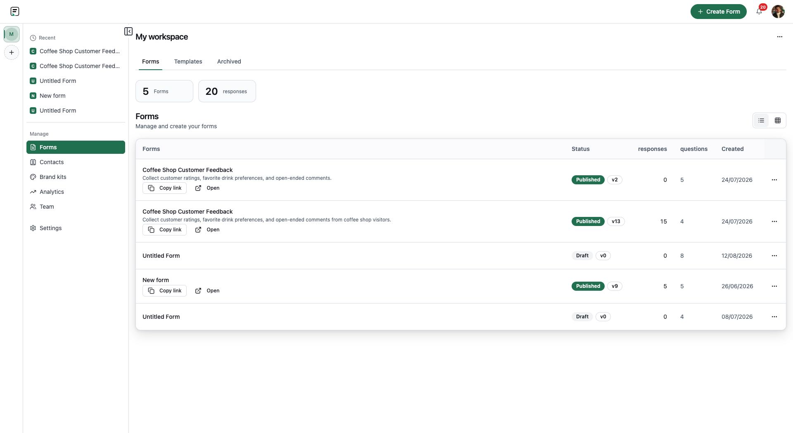

## Problem

Most form tools start from a blank canvas of field types. Clients wanted a conversation: describe the intake, get a working form, then let AI chase incomplete answers after publish.

## What we discussed

We split the product into four surfaces so marketing, the builder, public forms, and embeds could ship and scale on their own hosts. Tenancy lives in the Fastify API. Integrations fan out after submit and never block the submission.

## What shipped

- Next.js marketing site at formitai.com
- Vite builder and dashboard at app.formitai.com (authenticated app is `/dashboard`)
- Next.js public form runtime at form.formitai.com
- Vanilla `embed.js` at embed.formitai.com
- Fastify + Prisma API with org roles and plans
- Slack OAuth, Google Sheets append, Zapier bridge, WhatsApp alerts
- AI generation from a prompt, plus follow-ups on vague answers
- Workspace analytics, contacts, brand kits, branded `*.formitai.com` form URLs
- Six embed modes: standard, full page, popup, slider, popover, side tab

## How it was built

Frontend monorepo (npm workspaces): `apps/www`, `apps/web`, `apps/admin`, `apps/form-runtime`, plus shared `form-renderer` and `embed` packages. Backend is Fastify + TypeScript + Prisma on PostgreSQL, Redis in the stack, OpenAI for generation and follow-ups.

## How it was deployed

Ubuntu, nginx, and PM2.

| Host | Surface |
|------|---------|
| formitai.com | Marketing Next app |
| app.formitai.com/dashboard | Authenticated builder SPA |
| form.formitai.com | Public forms |
| embed.formitai.com | embed.js |
| api.formitai.com | Fastify API |

Branded form URLs use a workspace subdomain on `*.formitai.com`. Bare `app.formitai.com` sends visitors to marketing; the logged-in product lives under `/dashboard` and `/form-builder`.

## Extra screens

Logged-in Forms dashboard. Published and draft table, response counts.

Create flow. Generate with AI, use a template, or build manually.

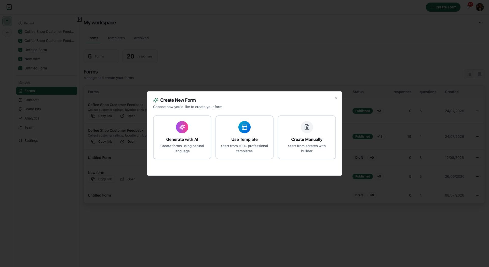

AI generate. Describe the form in plain English, then generate.

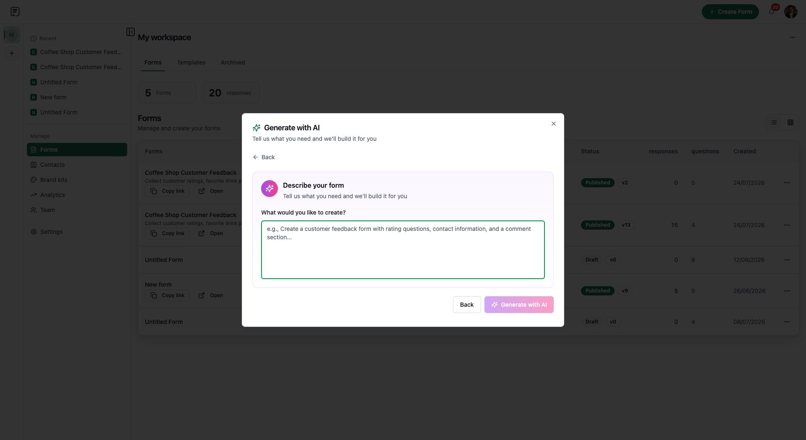

Visual builder. Outline, conversational canvas, Properties and Theme.

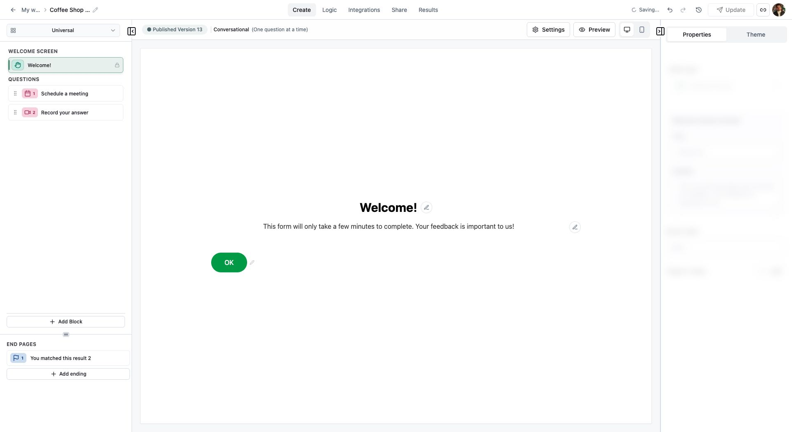

Public runtime. One question at a time, Powered by FormitAI.

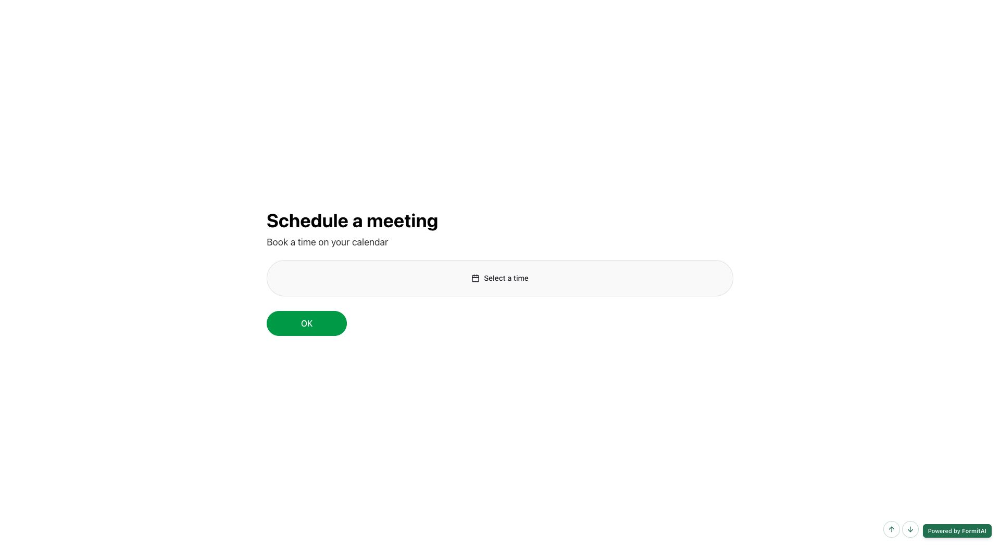

Per-form results. Volume chart and searchable submissions.

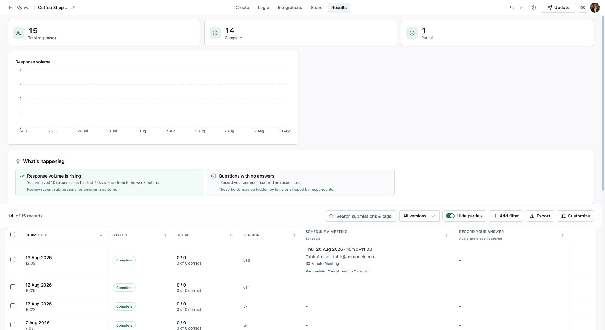

Workspace analytics. Views, funnel, devices, question rates.

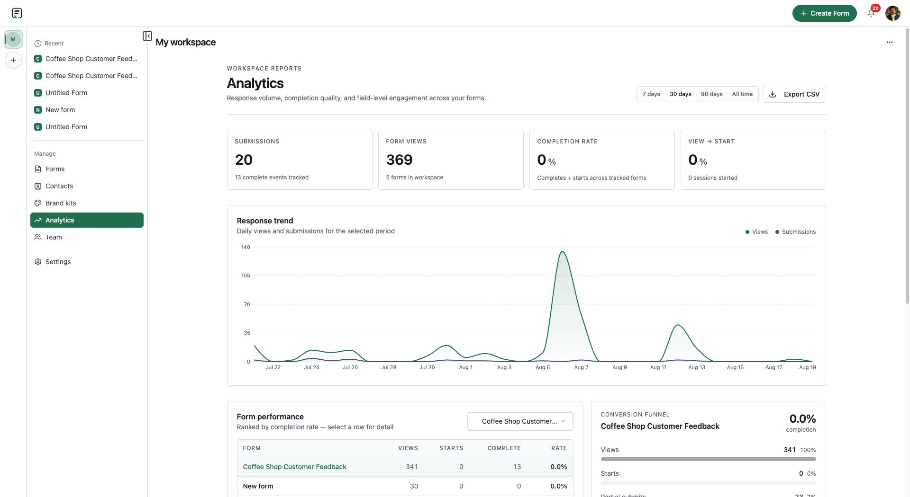

Webpage embed designer. Six modes plus Embed SDK.

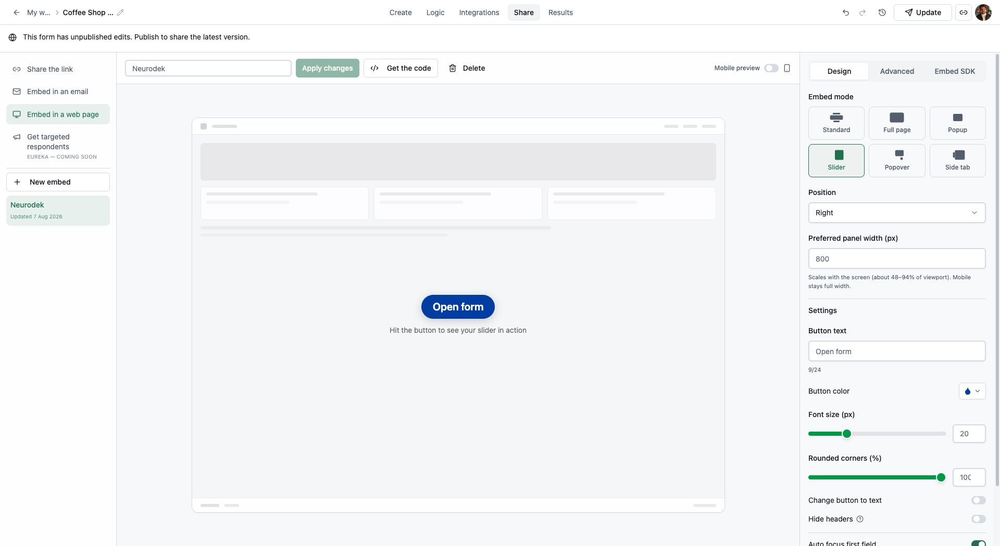

Integrations. WhatsApp, Slack, Sheets, Zapier catalog.

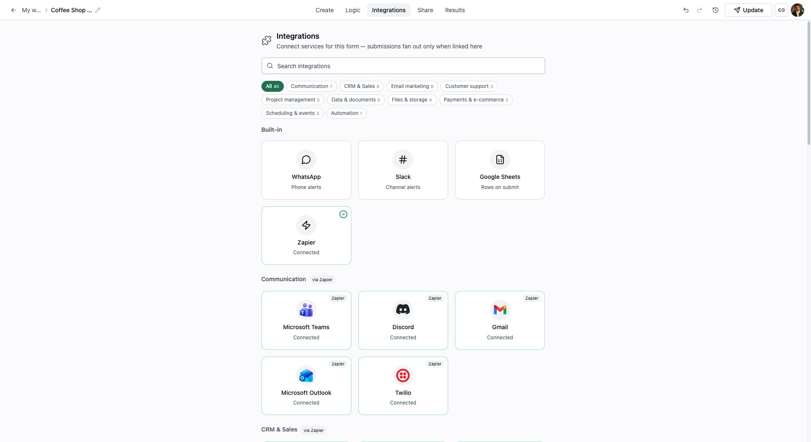

Share. Public link, OG preview, branded subdomain, QR.

Workspace settings. Org, layout, subdomain, billing.

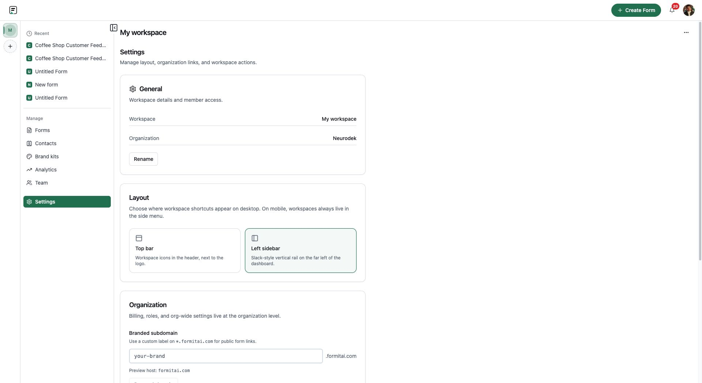

Marketing homepage.

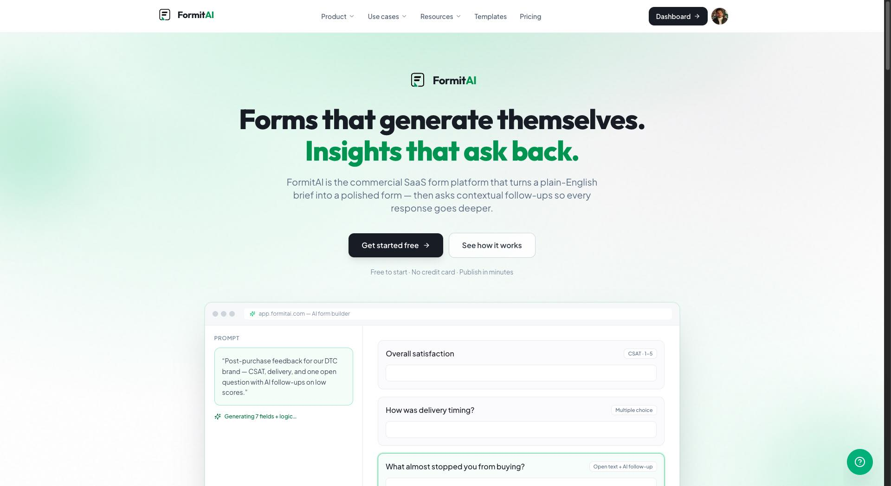

## Open live product

[formitai.com](https://formitai.com) · [App dashboard](https://app.formitai.com/dashboard)

[All case studies](index.md) · [Interactive portfolio](https://tahirkodx.github.io/tahirkodx/#formitai)
